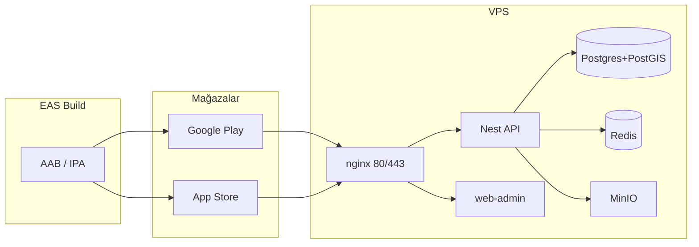

# Motogram — Uçtan uca yayın ve deploy rehberi

Bu doküman, **mobil uygulamayı mağazalara** çıkarmak için gereken **backend, yönetim arayüzü, altyapı ve mobil build** adımlarını tek akışta toplar. Ayrıntılı operasyonel detaylar için mevcut runbook’lara referans verir.

| Ne | Nerede |
|----|--------|
| VPS + Docker Compose prod deploy (önerilen hat) | [DEPLOY_QUICKSTART.md](./DEPLOY_QUICKSTART.md), [DEPLOY_RUNBOOK.md](./DEPLOY_RUNBOOK.md) |
| Zod strict / metrik bake | [DEPLOY_RUNBOOK.md](./DEPLOY_RUNBOOK.md) § R12 |
| EAS dev client / Mapbox | [EAS_DEV_CLIENT_ROADMAP.md](./EAS_DEV_CLIENT_ROADMAP.md) |

---

## 1. Mimari özeti



- **Kullanıcı cihazı** → HTTPS → **nginx** → `/v1/*` **API**, diğer yollar **web-admin** (admin paneli).
- **Mobil uygulama** derlemesi **EAS (Expo)** üzerinde; mağazaya yüklenen paketler bu build’lerden gelir.
- **API + veri** çoğu kurulumda aynı VPS üzerinde `docker-compose.prod.yml` ile (Postgres, Redis, MinIO, Prometheus/Grafana opsiyonel).

---

## 2. Yayın öncesi hazırlık (tüm ekip)

### 2.1 Hesap ve yasal

- [ ] **Domain** (ör. `api.example.com`, `admin.example.com` veya path tabanlı tek host).
- [ ] **TLS** sertifikası (Let’s Encrypt; repodaki `infra/nginx` + `NGINX_CONF` ile uyumlu).
- [ ] **Gizlilik politikası / Kullanım şartları** URL’leri (mağaza formlarında zorunlu).
- [ ] **Google Play** geliştirici hesabı, **Apple Developer** programı (yıllık ücret).
- [ ] **EAS / Expo** hesabı; `apps/mobile/app.json` → `owner` ve `extra.eas.projectId` production projeyle eşleşsin.
- [ ] **Sentry** (opsiyonel) DSN’leri: API, mobil, web-admin için ayrı proje.

### 2.2 Sırlar (asla repoya commitlenmez)

- [ ] `JWT_ACCESS_SECRET`, `JWT_REFRESH_SECRET`, `INTERNAL_API_SHARED_SECRET` (≥ 32 karakter).
- [ ] `NEXTAUTH_SECRET` (web-admin).
- [ ] Postgres, Redis, MinIO parolaları (`.env.prod` — bkz. [docker-compose.prod.yml](../docker-compose.prod.yml) üst yorumu).
- [ ] **Mapbox:** public + download token (mobil EAS secret’ları).
- [ ] **FCM** (Android push) / **APNS** (iOS) — API ortam değişkenleri veya volume yolları (Compose’ta `FCM_CREDENTIALS_PATH`, `APNS_AUTH_KEY_PATH`).
- [ ] OAuth: `APPLE_CLIENT_ID`, `GOOGLE_CLIENT_IDS` (boşsa ilgili uçlar 503 — bilinçli).

### 2.3 VPS minimum (öneri)

- **2 vCPU, 4 GB RAM** (Postgres + API + nginx + web-admin; izleme ve MinIO ile rahat nefes).
- **Disk:** log + medya büyümesine göre; yedekleme ayrı planlanmalı.
- **Firewall:** sadece 22 (SSH, kısıtlı), 80, 443 açık; 3000 dışarıya kapalı (Compose zaten API’yi doğrudan publish etmez — nginx üzerinden erişim).

---

## 3. Backend’i VPS’e deploy (Docker)

### 3.1 İlk kurulum

1. Sunucuya **Docker** + **Docker Compose** v2 kur.
2. Repoyu klonla: `git clone …` ve `main` (veya tag’li release) checkout.
3. Kökte **`.env.prod`** oluştur: [`.env.example`](../.env.example) ile diff al; [DEPLOY_QUICKSTART.md](./DEPLOY_QUICKSTART.md)’teki `DATABASE_URL` notuna uy: Compose çoğu değişkeni senin adına üretir.
4. `chmod 600 .env.prod`
5. `bash scripts/deploy.sh` (veya Quickstart’teki adım adım). Bu süreç: **API imajı** → **migrate** → **stack `up -d`**.
6. Dış doğrulama: `curl -fsS https://<senin-api-host>/v1/livez` ve `.../v1/readyz`.

### 3.2 PgBouncer (ileri seviye)

VPS’te ileride connection pool keskinleştirmesi için PgBouncer devreye alınacaksa [DEPLOY_RUNBOOK.md](./DEPLOY_RUNBOOK.md) PgBouncer bölümüne uy: ilk migrasyon **doğrudan Postgres** portuna; sonra uygulama PgBouncer URL’e geçer.

### 3.3 Otomatik sağlık kontrolü (sunucuda)

```bash
cd /opt/motogram   # kendi yolun
bash scripts/verify-vps-health.sh
```

Dış host ile: `VERIFY_BASE_URL=https://api.senin-domainin.app bash scripts/verify-vps-health.sh`

---

## 4. PaaS alternatifi: API’yi ayrı serviste (ör. Railway)

Monorepoda yalnızca API’yi ayrı bir PaaS’e koyacaksan:

- **Kök dizin** repository kökü olmalı (workspace: `package.json` + `pnpm-workspace.yaml`).
- **Build:** `pnpm run build:api`  
  (sıra: `@motogram/shared` derleme → `prisma generate` → `nest build` + seed tsc; kök [package.json](../package.json) script’i.)
- **Start:** `pnpm --filter @motogram/api start` (context `apps/api` için uygun).
- Aynı **env** değişkenleri VPS `.env.prod` mantığında PaaS paneline girilir; **Postgres/Redis** yönetim servisi veya harici sağlayıcı ile URL’ler güncellenir.

> Mobil için **CORS** ve public API URL’leri bu ortamın gerçek `https` adresine göre [eas.json](../apps/mobile/eas.json) production `env` ile eşleşmelidir.

---

## 5. Web admin (Next.js) ve domain

- Prod stack’te **web-admin** konteyneri [docker-compose.prod.yml](../docker-compose.prod.yml) içinde tanımlı; **nginx** admin ve API rotalarını ayırır.
- Ortam değişkenleri (örnek isimler): `NEXTAUTH_URL` (admin’in dış URL’i), `NEXTAUTH_SECRET`, `NEXT_PUBLIC_API_BASE_URL` (genelde `https://api.../v1` — Compose örneğine bak).
- İlk **ADMIN** kullanıcı: veritabanında `role: ADMIN` bir kullanıcı yoksa seed / manuel script ile oluşturulur; E2E seed örneği: `prisma/seed-test-users.ts` (sadece test amaçlı sabit hesaplar; prod’da güçlü, benzersiz parola).

---

## 6. Mobil uygulama — EAS ve mağazaya hazırlık

### 6.1 EAS proje ve sırlar

- `eas login` → proje: `app.json` içindeki `owner` + `extra.eas.projectId`.
- EAS **project** secret’ları:  
  `RNMAPBOX_MAPS_DOWNLOAD_TOKEN` (Mapbox sk., Gradle indirme), `EXPO_PUBLIC_MAPBOX_TOKEN` (pk., runtime). Bkz. [EAS_DEV_CLIENT_ROADMAP.md](./EAS_DEV_CLIENT_ROADMAP.md).

### 6.2 API adresi (production)

[apps/mobile/eas.json](../apps/mobile/eas.json) içinde **`production`** profili `EXPO_PUBLIC_API_URL` / `EXPO_PUBLIC_WS_URL` alanlarını **gerçek prod API** (HTTPS) ile doldur. Örnek:

- `https://api.senin-domainin.app/v1`  
- `https://api.senin-domainin.app` (WebSocket / Socket.io host; backend’in beklediği sözleşmeye uyun).

> IP ile HTTP, mağaza incelemesinde ve iOS’ta zorluk çıkarabilir; **sertifikalı domain** hedefleyin.

### 6.3 Sürüm ve bundle ID

- `app.json` / `app.config`: `version`, `android.package`, `ios.bundleIdentifier` mağaza kayıtlarıyla **birebir** aynı olmalı.
- EAS: `eas build --profile production --platform android` (AAB) ve iOS için `--platform ios` (veya her ikisi `all`).

### 6.4 Google Play (Android) — kısa kontrol listesi

- [ ] Play Console uygulama kaydı, içerik derecelendirme, veri güvenliği formu.
- [ ] AAB (App Bundle) yükleme; imzalama: Play App Signing (EAS üretir).
- [ ] Gerekirse: push bildirimleri, arka planda konum açıklamaları (manifest ile uyumlu; `app.json` zaten açıklama alanları içerir).
- [ ] Ekran görüntüleri, kısa / uzun açıklama, gizlilik politikası linki.

### 6.5 Apple App Store (iOS) — kısa kontrol listesi

- [ ] **Apple Developer** sertifikalar, App ID, EAS’te iOS credentials (Expo yönetebilir).
- [ ] Gizlilik / izin metinleri (`Info.plist` açıklamaları; Expo `app.json` `ios.infoPlist`).
- [ ] `ITSAppUsesNonExemptEncryption` (mevcut projede false; değişirse export uyumu).
- [ ] TestFlight → üretim incelemesi; App Review yönergeleri (kullanıcı verisi, harita, konum).

### 6.6 Submit (opsiyonel otomasyon)

- `eas submit` ile store bağlantısı; API anahtarları (Play JSON, App Store Connect) EAS/CI’da güvenle saklanır.

---

## 7. Uçtan uca sıra (önerilen yürüyüş)

1. **Backend** ayağa (VPS + Compose veya PaaS) → `livez` / `readyz` yeşil.
2. **Migrasyon** ve gerekirse **seed** (sadece prod uygun, kontrollü).
3. **Web-admin** erişilebilir ve en az bir **ADMIN** girişi test edildi.
4. **Mobil** `eas.json` production env URL’leri **prod API** ile güncel.
5. EAS **production** build (Android AAB, iOS IPA).
6. İç test (TestFlight + dahili track) → sonra **mağaza incelemesi** gönderimi.
7. Yayın sonrası: Sentry, Grafana, [DEPLOY_RUNBOOK](./DEPLOY_RUNBOOK.md) § 24h bake, SLO script’leri.

---

## 8. Sık hatalar

| Belirti | Olası neden |
|--------|-------------|
| PaaS’te `nest build` yüzlerce `TS2307` | Monorepoda **önce** `pnpm run build:api` veya `@motogram/shared` derlenmeden API build. |
| Mobil “network error” | Yanlış `EXPO_PUBLIC_*_URL`, HTTP/HTTPS uyuşmazlığı, sertifika, veya CORS. |
| Admin’e giremiyorum | Kullanıcı yok / rol `ADMIN` değil; `NEXTAUTH_*` uyuşmazlığı. |
| 503 OAuth | `APPLE_CLIENT_ID` / `GOOGLE_CLIENT_IDS` boş. |

---

## 9. İlgili dosyalar (kod)

| Dosya | Amaç |
|-------|------|
| [docker-compose.prod.yml](../docker-compose.prod.yml) | Tüm prod servisleri |
| [apps/api/Dockerfile](../apps/api/Dockerfile) | API imajı (shared build + prisma + nest) |
| [apps/web-admin/Dockerfile](../apps/web-admin/Dockerfile) | Admin imajı |
| [package.json](../package.json) | `build:api` (CI / Railway) |
| [apps/mobile/eas.json](../apps/mobile/eas.json) | EAS profilleri ve prod API env |

Bu doküman, versiyon çıktıkça **milestone** (VPS hazır, API canlı, mağaza onayı) maddelerini işaretleyerek ilerletilmelidir.
