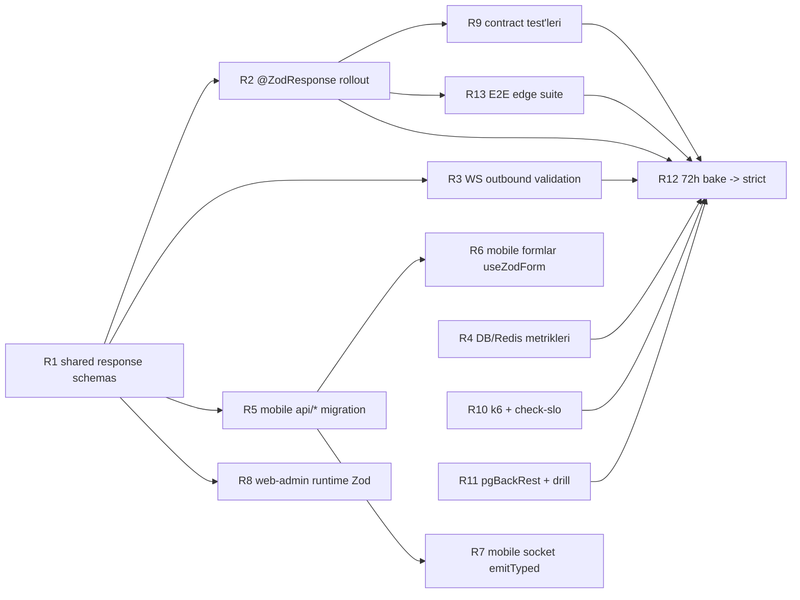

# Motogram — Zod Tam Entegrasyon Yol Haritası (v2)

> **Kayıt eşiği:** Her R-fazı / alt görev bittiğinde bu dosyanın **§18–19**
> bölümleri ile `docs/PROJECT_BOARD.md` (**§1 canlı durum + §5 kronolojik log**)
> birlikte güncellenir. Tek kaynak pano + yol haritası senkron kalır.

> Amaç: Projeyi mevcut **~%60 Zod entegrasyonundan** **%100 runtime-safe** bir
> sisteme taşımak. Hiçbir fazda üretim kırılmayacak şekilde, her PR kendi
> başına mergelenebilir ve geri alınabilir olacak. Her faz için **VPS
> etkisi**, **rollback**, **test kriteri** ve **bitmiş sayılma koşulu**
> açıkça yazılı.
>
> **v2 notu (ek faz J/K/L + Faz D kademeli rollout):** İlk sürümde HTTP +
> WebSocket + mobile forms kapsanmıştı. v2 bu taraflara üç kritik katman
> daha ekliyor: **BullMQ job payload’ları**, **EventEmitter2 olay
> payload’ları** ve **Environment Variables**. Bunlar olmadan projede hâlâ
> Zod ağının **görünmez delikleri** kalıyordu (arka plan işleri, modüller
> arası sinyaller, prod env config). Ayrıca Faz D (backend response
> serializer) artık 3 alt adımda kademeli rollout ediliyor.

---

> **Not (2026-04-24+)**: Mobil istemci hedefi artık **`apps/mobile-native`**. Bu yol haritasındaki
> eski `apps/mobile` / `@motogram/mobile` referansları **legacy** kabul edilmelidir; yeni işler için
> doğrulama komutları `@motogram/mobile-native` üzerinden yürütülür.

## 0) Genel prensipler

- **Backward compatible**: Hiçbir API contract’ı KIRILMAZ. Yeni response
  şemaları ham alanlar üzerine eklenir, kaldırılmaz. `z.object().passthrough()`
  ile bilinmeyen alanlar silinmez.
- **Feature flag mantığı**: Mobile response validation ilk aşamada
  `warn-only` modda devreye alınır (Sentry’ye log, throw değil). Stabil
  olunca `strict` moda geçilir.
- **Tek SSOT**: `packages/shared/src/schemas/*.schema.ts`. Backend + mobile +
  web-admin üçü de buradan tüketir. Başka yerde Zod tanımı açılmaz.
- **VPS etkisi** her fazın başında belirtilir:
  - `NONE` → sadece kod/deploy, ek bir şey yok
  - `REDEPLOY` → mevcut Docker stack `up -d --build` yeterli
  - `MIGRATION` → veritabanı değişir (bu planda yok)
  - `ENV` → yeni environment variable eklenir
- **Rollback planı**: Her PR tek commit/revert ile geri alınabilir. Hiçbir
  faz önceki fazın kalıcı kurbanı değil.

---

## 1) Mevcut durum özeti (baseline)

| Alan | Puan | Kritik eksik |
|---|---|---|
| SSOT `packages/shared` | 10/10 | — |
| Backend input validation (HTTP) | 10/10 | — |
| Backend response validation | 7/10 | Prisma objesi direkt dönüyor, drift tespit edilmez |
| WebSocket event sözleşmesi | 8/10 | Mobile emit runtime parse etmiyor |
| **BullMQ job payload validation** | **0/10** | 3 queue (`location-sync`, `media`, `deletion`) Zod’suz, DLQ riski |
| **EventEmitter2 payload validation** | **0/10** | `@OnEvent('gamification.trigger')`, `@OnEvent(AUTH_LOGIN_EVENT)` payload’ı runtime parse edilmiyor |
| **Environment vars Zod validation** | **0/10** | `ConfigModule.forRoot({ isGlobal: true })` — `validate:` yok, JWT_SECRET boş geçerse fark edilmez |
| Mobile types import | 10/10 | — |
| Mobile form validation | 4/10 | Sadece 2 ekran `safeParse`, RHF yok |
| Mobile response validation | 2/10 | `return data as T` |
| Web-admin | 2/10 | Sadece tip, runtime yok |
| **TOPLAM** | **~%60** | |

Hedef: **%100** (bkz. madde 13’teki kabul kriteri).

---

## 2) Fazlar — üst seviye

| Faz | Kapsam | Süre | VPS etkisi | Risk |
|---|---|---|---|---|
| A | **Response Schema** tanımları (`shared`) | 3 sa | NONE | Çok düşük |
| B | **Mobile `apiRequest`** Zod’dan geçsin | 3 sa | NONE | Düşük |
| C | **Mobile api/*.ts** (30+ dosya) schema geçişi | 4 sa | NONE | Düşük |
| **D1** | Backend `ZodSerializerInterceptor` altyapısı + **auth** endpoint’leri | 1 sa | **REDEPLOY** | Düşük |
| **D2** | Faz D1 stabilse **map + media** endpoint’lerine yay | 1 sa | **REDEPLOY** | Düşük |
| **D3** | Kalan tüm endpoint’leri `@ZodResponse` ile kapsa | 1 sa | **REDEPLOY** | Orta |
| E | **Mobile formlar** `react-hook-form` + `zodResolver` | 5 sa | NONE | Düşük |
| F | **WebSocket emit** validation wrapper’ı | 2 sa | NONE | Düşük |
| G | **Web-admin** aynı disipline sokma | 3 sa | NONE | Düşük |
| H | **CI contract testleri** | 3 sa | NONE | Düşük |
| **J** | **BullMQ job payload** validation (producer + DLQ koruması) | 3 sa | **REDEPLOY** | Düşük |
| **K** | **EventEmitter2 payload** validation (emit + @OnEvent) | 2 sa | **REDEPLOY** | Çok düşük |
| **L** | **Environment vars** Zod validation (`ConfigModule.validate:`) | 2 sa | **REDEPLOY** + ENV review | Orta |
| I | Stabilizasyon + `warn-only` → `strict` geçiş | 2 sa | NONE | Orta |
| **TOPLAM** | | **~35 sa** | 4-5× redeploy (her biri ~5-10 sn) | |

> Her faz kendi başına merge edilebilir. Hepsini aynı sprintte yapmak zorunlu
> değil; en kritik ikisi: **A+B+C** (mobile response güvenliği) ve **J+K+L**
> (backend iç katmanlar). Eski sıralama (A→I) HTTP yüzeyini kapatıyordu;
> v2’deki J/K/L sıralaması “görünmez” katmanlar (job, event, env). Ancak
> J/K/L **bağımsız**: E/F/G’den önce de yapılabilir.

---

## 3) Faz A — Response Schema’ları (packages/shared)

**VPS etkisi**: NONE
**Branch**: `feat/zod-response-schemas`
**Süre**: 3 sa

### 3.1 Kapsam

Şu an `shared/schemas/*.schema.ts` dosyalarının çoğunda sadece **input**
(request body) şemaları var (`CreatePostSchema`, `LoginSchema`, …). Yeni iş:
her endpoint için karşılığı **response** şemasını eklemek.

| Schema dosyası | Eksik response’lar |
|---|---|
| `auth.schema.ts` | `TokenPairSchema`, `AuthResultSchema`, `UserSchema` |
| `post.schema.ts` | `PostSchema`, `PostFeedResponseSchema` (paginated) |
| `message.schema.ts` | `ConversationSchema`, `MessageSchema`, `ConversationListSchema` |
| `map.schema.ts` | `MapMarkerSchema`, `NearbyRidersResponseSchema` |
| `media.schema.ts` | `UploadPresignResponseSchema` |
| …31 dosyanın tamamı | Aynı desen |

### 3.2 Yardımcılar

`packages/shared/src/lib/api-response.ts` eklenecek:

```ts
import { z } from 'zod';

// Paginated response helper (Spec 7.4.2 cursor pagination)
export const paginated = <T extends z.ZodTypeAny>(item: T) =>
  z.object({
    data: z.array(item),
    nextCursor: z.string().nullable(),
    hasMore: z.boolean(),
  });

// Standart hata zarfı (Spec 9.4)
export const ApiErrorSchema = z.object({
  error: z.string(),
  code: z.number(),
  details: z.unknown().optional(),
});

export type ApiError = z.infer<typeof ApiErrorSchema>;
```

### 3.3 Test kriteri

- [ ] `packages/shared` derlendiğinde tüm yeni schema’lar `dist/` altında
- [ ] `packages/shared/src/schemas/__tests__/response-schemas.spec.ts`:
      Her response için minimum 1 passing sample, 1 failing sample testi
- [ ] `pnpm --filter @motogram/shared test` yeşil

### 3.4 Bitmiş sayılma

Tüm endpoint’ler için `XxxRequestSchema` + `XxxResponseSchema` eşleşmiş,
`z.infer` ile tip üretilmiş, shared `dist/` yenilenmiş.

### 3.5 Rollback

Branch revert. Backend hiç dokunmadığı için üretim etkilenmez.

---

## 4) Faz B — Mobile apiRequest jenerik Zod’la

**VPS etkisi**: NONE
**Branch**: `feat/mobile-runtime-validation`
**Süre**: 3 sa
**Bağımlılık**: Faz A merged

### 4.1 Hedef

`apps/mobile/src/lib/api-client.ts`’deki `apiRequest<T>` imzasını değiştir:

**Önce:**
```ts
export async function apiRequest<T>(path: string, options): Promise<T> {
  // ... return data as T;
}
```

**Sonra:**
```ts
export async function apiRequest<S extends z.ZodTypeAny>(
  path: string,
  schema: S,
  options: RequestOptions = {},
): Promise<z.infer<S>> {
  // ... fetch ...
  const parsed = schema.safeParse(data);
  if (!parsed.success) {
    // warn-only mod: Sentry'e bildir ama throw etme (Faz I'de strict)
    captureSchemaDrift({ path, issues: parsed.error.issues, received: data });
    if (env.strictSchema) {
      throw new ApiClientError('schema_mismatch', 500, null);
    }
    return data as z.infer<S>; // geçici
  }
  return parsed.data;
}
```

### 4.2 Env flag

`apps/mobile/src/config/env.ts`’e eklenecek:

```ts
strictSchema: Constants.expoConfig?.extra?.strictSchema === true,
```

İlk release `false` (warn-only). Faz I’da `true` yapılır.

### 4.3 Sentry wiring

`apps/mobile/src/lib/sentry.ts`’e `captureSchemaDrift` eklenir, custom tag:
`source=api-schema-drift`. Dashboard’da tek satırda takip edilir.

### 4.4 Test kriteri

- [ ] `apps/mobile/src/lib/__tests__/api-client.spec.ts`:
  - Valid response → parse geçer, dönen veri doğru
  - Invalid response (extra/missing field) → Sentry çağrılır, warn-only ise
    `data as T` döner; strict ise throw
  - 401 → refresh akışı bozulmamış
- [ ] Jest coverage: `api-client.ts` %95+

### 4.5 Bitmiş sayılma

`apiRequest` yeni imza kullanıyor, mevcut çağrıların `schema` parametresini
henüz almıyor → geçiş döneminde **her iki imza** desteklenir (overload).
Faz C tamamlanınca eski imza kaldırılır.

### 4.6 Rollback

Branch revert. 30+ api dosyası hâlâ eski `apiRequest<T>` kullanıyor olacağı
için overload pattern sayesinde kırılma olmaz.

---

## 5) Faz C — Mobile api/*.ts’leri schema’ya bağla

**VPS etkisi**: NONE
**Branch**: `feat/mobile-api-modules-schemas`
**Süre**: 4 sa
**Bağımlılık**: Faz B merged

### 5.1 Kapsam

`apps/mobile/src/api/*.ts` içindeki **her çağrı** response schema’sı alır:

**Önce:**
```ts
export function loginRequest(dto: LoginDto): Promise<AuthResult> {
  return apiRequest<AuthResult>('/auth/login', { method: 'POST', body: dto });
}
```

**Sonra:**
```ts
import { AuthResultSchema } from '@motogram/shared';

export function loginRequest(dto: LoginDto): Promise<AuthResult> {
  return apiRequest('/auth/login', AuthResultSchema, {
    method: 'POST', body: dto,
  });
}
```

### 5.2 Migrasyon sırası (riske göre)

| Öncelik | Modül | Sebep |
|---|---|---|
| 1 | `auth.api.ts` | Auth kritik, burada hata login’i kırar |
| 2 | `media.api.ts` | Presigned URL yanlış gelirse upload çöker |
| 3 | `map.api.ts` | Çok veri, marker validation önemli |
| 4 | `posts.api.ts`, `community.api.ts`, `event.api.ts` | Feed ekranları |
| 5 | `party.api.ts`, `gamification.api.ts` | Runtime kritik ama frekans düşük |
| 6 | Kalanlar |

### 5.3 Test kriteri

- [ ] Her api dosyası için 1+ integration testi (MSW mock)
- [ ] `pnpm --filter @motogram/mobile test` yeşil
- [ ] Smoke test: Login, Map, Feed, Messaging ekranları warn-only modda
      hatasız açılıyor

### 5.4 Bitmiş sayılma

`apps/mobile/src/api/**` tamamı schema ile çağrılıyor. Overload desteği
silinip `apiRequest(path, schema, options)` tek imza kalır.

### 5.5 Rollback

Modül modül revert edilebilir (her bir api/*.ts ayrı commit).

---

## 6) Faz D — Backend ZodSerializerInterceptor (3-kademeli rollout)

**VPS etkisi**: **REDEPLOY × 3** (her kademe ayrı, ~5-10 sn downtime her seferinde)
**Branchler**: `feat/api-zod-serializer-d1`, `-d2`, `-d3`
**Süre**: 3 sa (3×1)
**Bağımlılık**: Faz A merged

> **v2 değişiklik:** Tek PR’da tüm backend endpoint’lerine `@ZodResponse`
> eklemek yerine 3 gruba bölündü. Her gruptan sonra **24 sa Sentry izleme**
> zorunlu. Drift varsa bir sonraki gruba geçilmez. Böylece Prisma
> Date/Decimal gibi tip uyumsuzlukları büyük patlama yapmadan yakalanır.

### 6.1 Hedef

Backend response’ları dönmeden önce schema’dan geçirmek. Prisma’dan gelen
Date/Decimal/Buffer/relations düzleştirme ihtiyacını da çözer.

### 6.2 Kod

`apps/api/src/common/interceptors/zod-serializer.interceptor.ts`:

```ts
import { CallHandler, ExecutionContext, Injectable, NestInterceptor } from '@nestjs/common';
import { Reflector } from '@nestjs/core';
import { map } from 'rxjs/operators';
import { ZodSchema } from 'zod';

export const ZOD_RESPONSE_KEY = 'zod:response';

export const ZodResponse = (schema: ZodSchema) =>
  Reflect.metadata(ZOD_RESPONSE_KEY, schema);

@Injectable()
export class ZodSerializerInterceptor implements NestInterceptor {
  constructor(private readonly reflector: Reflector) {}

  intercept(ctx: ExecutionContext, next: CallHandler) {
    const schema = this.reflector.get<ZodSchema>(
      ZOD_RESPONSE_KEY,
      ctx.getHandler(),
    );
    return next.handle().pipe(
      map((data) => (schema ? schema.parse(data) : data)),
    );
  }
}
```

### 6.3 main.ts

```ts
app.useGlobalInterceptors(new ZodSerializerInterceptor(app.get(Reflector)));
```

### 6.4 Controller kullanımı

Controller’larda:

```ts
@Post('login')
@ZodResponse(AuthResultSchema)
async login(@Body(new ZodBody(LoginSchema)) dto: LoginDto): Promise<AuthResult> {
  return this.authService.login(dto);
}
```

Şemasız endpoint’lerde response pass-through (geriye dönük uyumlu).

### 6.5 VPS redeploy adımları

```bash
ssh root@85.235.74.203
cd /opt/motogram   # veya kurulu olduğu yol
git pull origin main
docker compose up -d --build api
docker compose logs -f api | grep -i 'zod\|error'
```

**Kesinti süresi**: ~5-10 sn (container restart). Live user’lar için
`/health` probe + nginx proxy zaten graceful. Gece deploy tavsiye edilir ama
zorunlu değil.

### 6.6 Test kriteri

- [ ] `apps/api/src/common/interceptors/__tests__/zod-serializer.spec.ts`
- [ ] Her modül e2e testi: response’un schema’ya uyduğu doğrulanır
- [ ] `/v1/health` 200 dönmeye devam ediyor
- [ ] Sentry’de yeni “Zod response drift” errorları 24 saat boyunca izlenir

### 6.7 Kademeli rollout planı

| Kademe | Kapsam | Çıkış şartı |
|---|---|---|
| **D1** | Interceptor kodu merge + `main.ts`’e eklenir + `auth.controller.ts`’deki 4 endpoint’e `@ZodResponse` | 24 sa Sentry’de 0 drift, `/v1/auth/*` 100% başarılı |
| **D2** | `map.controller.ts` + `media.controller.ts` endpoint’leri (feed + upload akışları) | 24 sa Sentry’de 0 drift, harita ve upload metrikleri değişmemiş |
| **D3** | Kalan tüm controller’lar (~20 dosya) | 72 sa Sentry’de 0 drift |

Her kademe ayrı PR, ayrı VPS deploy. Ara sonuç kötüyse bir sonrakine geçme.

### 6.8 Bitmiş sayılma

- Tüm controller’lar `@ZodResponse(...)` dekoratörü alır
- Prod Sentry’de **72 saat** boyunca **sıfır** schema drift uyarısı
- Contract test coverage (Faz H) ≥ %90

### 6.9 Rollback

Kademe bazlı: `git revert <D3-commit>` + `docker compose up -d --build api`
→ interceptor kodu ayakta, sadece son eklenen dekoratörler geri alınır.
Tam rollback gerekirse D1’e kadar sıralı revert.

---

## 7) Faz E — Mobile formlar react-hook-form + zodResolver

**VPS etkisi**: NONE
**Branch**: `feat/mobile-forms-rhf`
**Süre**: 5 sa
**Bağımlılık**: Faz A merged

### 7.1 Kurulum

```bash
pnpm -F @motogram/mobile add react-hook-form @hookform/resolvers
```

### 7.2 Ortak hook

`apps/mobile/src/hooks/useZodForm.ts`:

```ts
import { useForm, UseFormProps } from 'react-hook-form';
import { zodResolver } from '@hookform/resolvers/zod';
import { ZodSchema, z } from 'zod';

export function useZodForm<S extends ZodSchema>(
  schema: S,
  props?: UseFormProps<z.infer<S>>,
) {
  return useForm<z.infer<S>>({
    ...props,
    resolver: zodResolver(schema),
    mode: 'onTouched',
  });
}
```

### 7.3 Dönüştürülecek ekranlar

| Ekran | Schema | Manuel safeParse var mı |
|---|---|---|
| `LoginScreen.tsx` (`src/screens/auth/`) | `LoginFormSchema` (trim + `LoginSchema` ile aynı kurallar) | **R6 (2026-04-22):** `useZodForm` + `Controller`; `.tsx` içinde `safeParse` yok |
| `RegisterScreen.tsx` (`src/screens/auth/`) | `RegisterScreenFormSchema` + gönderim `RegisterSchema.parse` | **R6 (2026-04-22):** `useZodForm` + EULA `superRefine`; `.tsx` içinde `safeParse` yok |
| `OtpScreen.tsx` | `OtpVerifySchema` (shared) | **R6 (2026-04-22):** `useZodForm`; API Faz 4 |
| `StoryCreateScreen.tsx` | `StoryCreateFormSchema` + `CreateStorySchema.parse` (govde) | **R6 (2026-04-22):** `useZodForm`; `story-create-form.schema.spec.ts` |
| `EventCreateScreen.tsx` | `EventCreateFormSchema` + `CreateEventSchema.safeParse` (govde) | **R6 (2026-04-22):** `useZodForm`; `event-create-form.schema.spec.ts` |
| `DiscoverModeSheet.tsx` | `DiscoverFiltersSchema` (store uzerinden) | **R6 (2026-04-22):** `map.store` + `map-filters.ts` + `map-filters.spec.ts` |
| `MapFilterBar.tsx` | `DiscoverFiltersSchema` (chip → `setFilter` → store) | **R6 (2026-04-22):** ayni store yolu; ayri `MapFiltersSchema` yok |
| `ConversationScreen.tsx` (mesaj yazma) | `ConversationComposeSchema` (TEXT govdesi) | **R6 (2026-04-22):** `useZodForm`; WS emit hâlâ `WsMessageSendSchema` (`wsEmitClient`) |
| `PartyInboxScreen.tsx` | `RespondPartyInviteSchema` (+ `party.api` `CreatePartySchema` vb.) | **R6 (2026-04-22):** davet Kabul/Reddet → `respondInvite`; `party-zod-guard.spec.ts` |
| `PartyCreateModal.tsx` (`MapScreen`, `DiscoverModeSheet` boş CTA, RIDE boş parti) | `CreatePartySchema` + `createParty` / `getParty` | **R6 (2026-04-23):** `useZodForm` + `party-zod-guard.spec.ts` (modal default payload) |
| `CommunityDetailScreen.tsx` (join form) | `CommunityJoinMessageSchema` + `JoinCommunitySchema.pick({ message })` | **R6 (2026-04-22):** `useZodForm` + opsiyonel mesaj alani |

### 7.4 Test kriteri

- [ ] Her form için component test: invalid input → submit disabled + error
      mesajı; valid input → API mock hit
- [ ] `LoginScreen` için a11y smoke (Ekran okuyucu etiketleri kırılmadı mı)
- [ ] Bundle size artışı < 25 KB (react-hook-form çok küçük)

### 7.5 Bitmiş sayılma

Manuel `useState` + `safeParse` kombinasyonu mobile’da **sıfır** kalır.
Grep: `apps/mobile/src --glob '*.tsx'` içinde `\.safeParse\(` = 0 hit.

### 7.6 Rollback

Ekran ekran revert edilebilir. Her ekranın dönüşümü ayrı commit.

---

## 8) Faz F — WebSocket emit runtime validation

**VPS etkisi**: NONE
**Branch**: `feat/socket-emit-validation`
**Süre**: 2 sa
**Bağımlılık**: Faz A merged

### 8.1 Hedef

`apps/mobile/src/lib/socket.ts`’deki `socket.emit` çağrılarını Zod’la
sarmak:

```ts
import { WS_EVENTS, ConversationJoinSchema, ... } from '@motogram/shared';

export function emitTyped<E extends keyof typeof WS_EVENTS_TO_SCHEMA>(
  event: E,
  payload: z.infer<typeof WS_EVENTS_TO_SCHEMA[E]>,
) {
  const schema = WS_EVENTS_TO_SCHEMA[event];
  const parsed = schema.parse(payload); // client-side hata anında fark edilir
  socket.emit(event, parsed);
}
```

Ayrıca `socket.on(event, listener)` için de bir `onTyped` wrapper’ı.

### 8.2 Test kriteri

- [ ] `useMessaging`, `useParty`, `useLocationBroadcast` hook’ları
      `emitTyped` kullanıyor
- [ ] Jest: invalid payload → client-side throw, server’a gitmiyor

### 8.3 Rollback

Tek commit revert.

---

## 9) Faz G — Web-admin hizalama

**VPS etkisi**: NONE
**Branch**: `feat/web-admin-zod`
**Süre**: 3 sa
**Bağımlılık**: Faz A, B

### 9.1 Hedef

- `apps/web-admin/src/lib/api-client.ts` mobile ile aynı pattern
  (`apiRequest(path, schema, options)`)
- `login/page.tsx`, `feature-flags/feature-flag-form.tsx`,
  `ab-tests/ab-test-form.tsx`, `users/users-table.tsx` formları
  `react-hook-form` + `zodResolver(sharedŞema)` ile doğrulansın (mobildeki
  `useZodForm` ile aynı Zod SSOT; web’de doğrudan RHF kullanılır)

### 9.2 Test kriteri

- [ ] `pnpm --filter @motogram/web-admin lint && build` yeşil
- [ ] Her form için Playwright/RTL test: invalid submit → error görünür

---

## 10) Faz H — CI contract tests

**VPS etkisi**: NONE  
**Gerçek uygulama (repo, R9)**: `apps/api/src/contract/public.contract.spec.ts` — Nest
`supertest`, tam `AppModule`; **CI**: Postgres + Redis servisleri → `prisma migrate deploy`
→ **`pnpm --filter @motogram/api test`** (contract klasörü Jest ile **hariç**) → **`pnpm --filter @motogram/api run test:contract`** + `CONTRACT_TESTS=1`.

### 10.1 Hedef

Başarılı HTTP yanıtları shared şemalarla doğrulanır; 4xx gövdeleri `ApiErrorSchema`
ile uyumlu mu kontrol edilir.

### 10.2 Uygulama (örnek)

```ts
const body = NearbyRidersResponseSchema.parse(res.body); // GET /v1/map/nearby …
ApiErrorSchema.parse(res.body); // 400/401/404 …
```

**Yerel:** `apps/api` içinde Postgres+Redis ayarlı `.env`; `pnpm run test:contract` öncesi
migration uygulanmış DB (boş şemada register düşmez).

### 10.3 Bitmiş sayılma

Kritik **okuma / hata şekli** senaryoları şemaya bağlı; **tüm** HTTP yüzeyi için %90+
coverage **R12 öncesi** roadmap kapsamında genişletilebilir.

---

## 10.5) Faz J — BullMQ job payload validation

**VPS etkisi**: **REDEPLOY** (`docker compose up -d --build api`)
**Branch**: `feat/bullmq-zod`
**Süre**: 3 sa
**Bağımlılık**: Faz A merged

### 10.5.1 Neden gerekli (gerçek dünya senaryosu)

`LocationService.updateLocation` bir refactor sonrası `userId` alanı yerine
`undefined` gönderirse:

1. Job BullMQ’ya girer (Zod yok, tip garantisi sadece compile time).
2. Worker `processJob`’da `session = await prisma.liveLocationSession.findUnique({ where: { id: sessionId }})` hattında `sessionId = undefined` → Prisma `P2025` → job fail.
3. BullMQ 5× retry + exponential backoff → DLQ’ya düşer.
4. Siz Sentry’ye bakıp fark edene kadar **saatler / günler** geçer. Bu arada
   canlı konum akışı kesiktir, kullanıcılar birbirini göremez.

Producer tarafında Zod parse olsaydı → job **hiç queue’ya girmezdi**, yazan
endpoint 500 atardı, log anında kırmızı.

### 10.5.2 Etkilenen kuyruklar

```
apps/api/src/modules/location/queue/location-sync.queue.ts   → LocationSyncJob
apps/api/src/modules/media/media.queue.ts                    → MediaProcessJob (sharp pipeline)
apps/api/src/modules/account/deletion.queue.ts               → AccountDeletionJob (retention)
```

### 10.5.3 Shared schema

Yeni dosya: `packages/shared/src/schemas/queue.schema.ts`:

```ts
import { z } from 'zod';

export const LocationSyncJobSchema = z.object({
  userId: z.string().uuid(),
  sessionId: z.string().uuid(),
  lat: z.number().min(-90).max(90),
  lng: z.number().min(-180).max(180),
  heading: z.number().min(0).max(360).nullable(),
  speed: z.number().min(0).nullable(),
  accuracy: z.number().min(0).nullable(),
  batteryLevel: z.number().int().min(0).max(100).nullable(),
  timestamp: z.number().int().positive(), // millis
});
export type LocationSyncJob = z.infer<typeof LocationSyncJobSchema>;

export const MediaProcessJobSchema = z.object({
  mediaId: z.string().uuid(),
  kind: z.enum(['image', 'video', 'thumbnail']),
  sourceKey: z.string().min(1),
  ownerUserId: z.string().uuid(),
});
export type MediaProcessJob = z.infer<typeof MediaProcessJobSchema>;

export const AccountDeletionJobSchema = z.object({
  userId: z.string().uuid(),
  scheduledAt: z.number().int().positive(),
  reason: z.enum(['user_requested', 'admin', 'policy']),
});
export type AccountDeletionJob = z.infer<typeof AccountDeletionJobSchema>;
```

### 10.5.4 Ortak wrapper

`apps/api/src/common/queue/zod-queue.ts`:

```ts
import { Queue } from 'bullmq';
import { Logger } from '@nestjs/common';
import { ZodSchema } from 'zod';

export async function addJobSafe<S extends ZodSchema>(
  queue: Queue,
  schema: S,
  jobName: string,
  data: unknown,
  opts?: Parameters<Queue['add']>[2],
): Promise<void> {
  const parsed = schema.safeParse(data);
  if (!parsed.success) {
    Logger.error(
      `queue_payload_invalid queue=${queue.name} job=${jobName} issues=${JSON.stringify(parsed.error.issues)}`,
      'ZodQueue',
    );
    throw new Error('invalid_queue_payload'); // producer endpoint 500 atsın, client retry etsin
  }
  await queue.add(jobName, parsed.data, opts);
}
```

Queue sınıflarında değişiklik:

```ts
// ÖNCE:
async enqueuePing(data: LocationSyncJob): Promise<void> {
  await this.queue.add('ping', data, { attempts: 5, ... });
}

// SONRA:
async enqueuePing(data: unknown): Promise<void> {
  await addJobSafe(this.queue, LocationSyncJobSchema, 'ping', data, {
    attempts: 5, ...,
  });
}
```

### 10.5.5 Worker tarafı (defansif ikinci kontrol)

Worker’ın `processJob`’ı da schema parse ile başlasın. Böylece Redis’te
önceden duran eski job’lar da yakalanır:

```ts
private async processJob(job: Job<unknown>): Promise<...> {
  const data = LocationSyncJobSchema.parse(job.data);
  // ... data güvenli
}
```

Bu noktada parse hatası DLQ’ya düşer ama artık **veriye dokunulmadan** — yani
kurtarılabilir (schema uyumlu yeni versiyon deploy edilince yeniden işlenir).

### 10.5.6 Test kriteri

- [ ] `apps/api/src/modules/location/queue/__tests__/location-sync.queue.spec.ts`:
  - Geçerli payload → `queue.add` çağrılır
  - Eksik `userId` → `throw invalid_queue_payload`, `queue.add` çağrılmaz
  - Eski Redis job (stale payload) → worker `processJob` throw, DLQ’ya gider
- [ ] Aynı testler `media.queue` ve `deletion.queue` için

### 10.5.7 Bitmiş sayılma

3 queue’nun producer + worker tarafı Zod’dan geçiyor. `grep -rn 'queue.add(' apps/api/src/modules` sonuçlarının tamamı `addJobSafe` kullanıyor.

### 10.5.8 Rollback

Tek commit revert + redeploy. Wrapper kaldırılınca eski `queue.add` davranışı geri gelir.

---

## 10.6) Faz K — EventEmitter2 payload validation

**VPS etkisi**: **REDEPLOY** (`docker compose up -d --build api`)
**Branch**: `feat/event-emitter-zod`
**Süre**: 2 sa
**Bağımlılık**: Faz A merged

### 10.6.1 Neden gerekli (gerçek dünya senaryosu)

Kod tabanında şu anda:

```ts
// gamification.service.ts:51
@OnEvent('gamification.trigger', { async: true, promisify: true })
```

Emit tarafında (`posts.service.ts` vb.):

```ts
this.eventEmitter.emit('gamification.trigger', { userId, type: 'POST_CREATED' });
```

Bir refactor `type: 'POST_CREATED'` yerine `type: 'post_created'` (küçük
harf) yazarsa:

1. EventEmitter2 event’i yine dispatch eder.
2. `GamificationService`’in handler’ı payload’ı alır.
3. İçindeki `switch(type)` ‘POST_CREATED’ case’iyle eşleşmez → **sessiz no-op**.
4. Kullanıcılar 1 ay boyunca rozet kazanamaz. Sentry’de hata yok, metricde anomali yok. **En tehlikeli bug tipi.**

### 10.6.2 Merkezi event bus wrapper

`apps/api/src/common/events/zod-event-bus.service.ts`:

```ts
import { Injectable, Logger } from '@nestjs/common';
import { EventEmitter2 } from '@nestjs/event-emitter';
import { ZodSchema } from 'zod';

@Injectable()
export class ZodEventBus {
  private readonly logger = new Logger(ZodEventBus.name);
  constructor(private readonly bus: EventEmitter2) {}

  emit<S extends ZodSchema>(event: string, schema: S, payload: unknown): boolean {
    const parsed = schema.safeParse(payload);
    if (!parsed.success) {
      this.logger.error(
        `event_payload_invalid event=${event} issues=${JSON.stringify(parsed.error.issues)}`,
      );
      throw new Error('invalid_event_payload');
    }
    return this.bus.emit(event, parsed.data);
  }
}
```

Export: `common/events/events.module.ts` (global).

### 10.6.3 Shared schema

`packages/shared/src/schemas/events.schema.ts`:

```ts
import { z } from 'zod';

export const AuthLoginEventSchema = z.object({
  userId: z.string().uuid(),
  deviceId: z.string().optional(),
  ip: z.string().optional(),
  at: z.number().int().positive(),
});

export const GamificationTriggerSchema = z.object({
  userId: z.string().uuid(),
  type: z.enum([
    'POST_CREATED', 'POST_LIKED', 'COMMENT_CREATED', 'STORY_CREATED',
    'EVENT_JOINED', 'RIDE_COMPLETED', 'FIRST_LOGIN',
  ]),
  meta: z.record(z.unknown()).optional(),
  at: z.number().int().positive(),
});

// diğer event'ler...
export const EVENT_SCHEMAS = {
  'auth.login': AuthLoginEventSchema,
  'gamification.trigger': GamificationTriggerSchema,
} as const;
```

### 10.6.4 Handler tarafında da parse

`@OnEvent` handler’ı da payload’ı parse etsin (iki tarafı da ayrı ayrı güvenli):

```ts
@OnEvent('gamification.trigger', { async: true, promisify: true })
async onTrigger(rawPayload: unknown) {
  const payload = GamificationTriggerSchema.parse(rawPayload);
  // payload artık %100 güvenli
}
```

### 10.6.5 Etkilenen dosyalar (grep sonuçları)

```
apps/api/src/modules/account/account.service.ts:35   @OnEvent(AUTH_LOGIN_EVENT)
apps/api/src/modules/gamification/gamification.service.ts:51  @OnEvent('gamification.trigger')
+ tüm `eventEmitter.emit(...)` çağrıları (stories, posts, follows, motorcycles, emergency, auth)
```

### 10.6.6 Test kriteri

- [ ] Unit: `ZodEventBus` invalid payload → throw, valid payload → emit
- [ ] Integration: `PostsService.create` → `gamification.trigger` payload parse’dan geçti mi
- [ ] Negatif: Yanlış `type` string → hem emit hem handler throw, retry yok (EventEmitter2 zaten retry yapmıyor)

### 10.6.7 Bitmiş sayılma

`grep -rn 'eventEmitter\.emit\|this.bus.emit' apps/api/src/modules` → tamamı `ZodEventBus.emit()` veya eşdeğer wrapper kullanıyor. Aynı şekilde `@OnEvent` handler’larının ilk satırı `Schema.parse(...)`.

### 10.6.8 Rollback

Commit revert + redeploy. Handler-tarafı parse kalırsa bile hatasız (raw payload parse’a uyuyor olmalı).

---

## 10.7) Faz L — Environment vars Zod validation

**VPS etkisi**: **REDEPLOY** + **ENV review** (prod env dosyası kontrol edilmeli)
**Branch**: `feat/env-zod`
**Süre**: 2 sa
**Bağımlılık**: Yok

### 10.7.1 Neden gerekli

`apps/api/src/app.module.ts:39`:

```ts
ConfigModule.forRoot({ isGlobal: true }),
```

Validation **yok**. Prod’da:

- `JWT_SECRET=` (boş) → uygulama ayağa kalkar, ilk login’de kriptografi hatası.
- `DATABASE_URL=` yanlış formatlı → Prisma connection’da runtime hatası, uygulama crash, restart loop.
- `MINIO_ENDPOINT=` eksik → media upload’ında 500, kullanıcı story atamıyor.
- `REDIS_URL=` yoksa → BullMQ sessiz hata, queue çalışmaz.

Hepsi **deploy anında** fark edilmesi gereken şeyler. Zod ile fail-fast.

### 10.7.2 Shared env schema

`apps/api/src/config/env.schema.ts` (shared’a değil, sadece api’de):

```ts
import { z } from 'zod';

export const ApiEnvSchema = z.object({
  NODE_ENV: z.enum(['development', 'test', 'staging', 'production']).default('development'),
  API_PORT: z.coerce.number().int().positive().default(3000),

  DATABASE_URL: z.string().url().refine(
    (v) => v.startsWith('postgresql://') || v.startsWith('postgres://'),
    { message: 'DATABASE_URL must be a postgres URL' },
  ),
  REDIS_URL: z.string().url().refine((v) => v.startsWith('redis://'), {
    message: 'REDIS_URL must start with redis://',
  }),

  JWT_ACCESS_SECRET: z.string().min(32, 'min 32 char entropy required'),
  JWT_REFRESH_SECRET: z.string().min(32, 'min 32 char entropy required'),
  JWT_ACCESS_TTL: z.string().default('15m'),
  JWT_REFRESH_TTL: z.string().default('7d'),

  MINIO_ENDPOINT: z.string().min(1),
  MINIO_PORT: z.coerce.number().int().positive().default(9000),
  MINIO_ACCESS_KEY: z.string().min(1),
  MINIO_SECRET_KEY: z.string().min(1),
  MINIO_BUCKET: z.string().min(1).default('motogram-media'),
  MINIO_USE_SSL: z.coerce.boolean().default(false),

  SENTRY_DSN: z.string().url().optional(),
  DISABLE_BULLMQ_WORKER: z.enum(['0', '1']).optional(),
});

export type ApiEnv = z.infer<typeof ApiEnvSchema>;
```

### 10.7.3 ConfigModule’a bağla

`app.module.ts`:

```ts
ConfigModule.forRoot({
  isGlobal: true,
  validate: (raw) => {
    const parsed = ApiEnvSchema.safeParse(raw);
    if (!parsed.success) {
      // PROCESS CRASH — deploy anında fark edilmeli
      console.error('❌ Invalid environment:');
      for (const issue of parsed.error.issues) {
        console.error(`  - ${issue.path.join('.')}: ${issue.message}`);
      }
      process.exit(1);
    }
    return parsed.data;
  },
}),
```

`ConfigService<ApiEnv>` artık tipli. Her `config.get('JWT_ACCESS_SECRET')`
string (min 32 char) garantili.

### 10.7.4 VPS deploy adımları

Yeni şartlar: deploy ÖNCESİ VPS `.env` dosyasını kontrol et:

```bash
ssh root@85.235.74.203
cd /opt/motogram
# env.example ile canlı .env'i karşılaştır
diff .env.example .env

# JWT secret'larını minimum 32 char ile doldur (varsa eski hali sakla)
openssl rand -base64 48  # örnek
```

Deploy:

```bash
git pull
docker compose up -d --build api
# eğer env geçersizse container yukarı çıkmaz:
docker compose logs api --tail 50
```

**Önemli**: Env kötüyse `process.exit(1)` → container restart loop. Bu tam olarak istediğimiz; çünkü sessiz başarısızlıktan çok daha iyi. Restart loop = hemen Uptime Kuma/Pingdom alarmı.

### 10.7.5 Test kriteri

- [ ] Unit: `ApiEnvSchema.parse({})` → throws with detailed issues
- [ ] Unit: Valid env → `ApiEnv` objesi döner
- [ ] E2E: Invalid env ile start → NestFactory.create throw, app ayağa kalkmaz

### 10.7.6 Bitmiş sayılma

- `.env.example` schema ile eşleşiyor (her alan belgeli)
- Prod `.env` dosyası tüm required alanlara sahip
- Staging’de bir eksik env denenmiş, container restart loop’a girmiş (pozitif test)

### 10.7.7 Rollback

Commit revert + redeploy. Ancak **eski `.env` hâlâ desteklenir** (validation
yokken ayağa kalkıyordu); rollback sonrası regression yok.

---

## 11) Faz I — warn-only → strict geçişi

**VPS etkisi**: NONE (sadece mobile config)
**Branch**: `chore/strict-schema`
**Süre**: 2 sa
**Bağımlılık**: Tüm önceki fazlar merged + prod’da 72 saat sıfır drift

### 11.1 Ön koşullar

- [ ] Sentry dashboard’da **72 saat** boyunca sıfır `schema_drift` event
- [ ] Backend contract testleri 100% pass
- [ ] Mobile TestFlight/Internal build 1 hafta kullanıcı testinden geçmiş

### 11.2 Değişiklik

`apps/mobile/app.json → extra.strictSchema: true`. Yeni EAS build.

### 11.3 Rollback

Flag’i `false` yapıp OTA update ile rollback (EAS Update). 15 dk.

---

## 12) VPS etki özeti (v2)

| Faz | VPS ne yapar | Downtime | Ön-deploy kontrol |
|---|---|---|---|
| A | — | Yok | — |
| B | — | Yok | — |
| C | — | Yok | — |
| **D1** | `docker compose up -d --build api` (auth endpointleri serializer’a girer) | ~5-10 sn | Sentry dashboard açık |
| **D2** | `docker compose up -d --build api` (map+media) | ~5-10 sn | D1 sonrası 24 sa drift=0 |
| **D3** | `docker compose up -d --build api` (kalan) | ~5-10 sn | D2 sonrası 24 sa drift=0 |
| E | — | Yok | — |
| F | — | Yok | — |
| G | — veya web-admin container redeploy | 0-5 sn | — |
| H | CI’da çalışır | Yok | — |
| **J** | `docker compose up -d --build api` (BullMQ wrapper devrede) | ~5-10 sn | DLQ boş mu? |
| **K** | `docker compose up -d --build api` (EventBus devrede) | ~5-10 sn | Gamification metrikleri normal mi? |
| **L** | `.env` doğrulandıktan sonra `docker compose up -d --build api` | 0 veya restart loop | **Zorunlu**: `diff .env.example .env`, JWT secret’ları ≥32 char mı? |
| I | — (sadece mobile) | Yok | — |

Toplam VPS redeploy: **5-6** (her biri ~5-10 sn graceful restart).
Kümülatif downtime: **< 1 dakika**.

Veritabanı migration’ı: **YOK**.
Yeni env var: **YOK zorunlu** (Faz L sadece mevcutları doğruluyor; eksik
olanlar varsa prod `.env`’e doldurulması gerekiyor — ama bunlar zaten
`.env.example`’da tanımlı şeyler).
Nginx/SSL değişikliği: **YOK**.

---

## 13) Kabul kriteri (proje sonu, v2)

| Metric | Baseline | Hedef |
|---|---|---|
| Zod entegrasyon skoru | %60 | **%100** |
| `apiRequest<T>` kullanım sayısı (schema’sız) | 30+ | 0 |
| Mobile `useState + safeParse` form sayısı | 2 | 0 |
| Backend `@ZodResponse` dekoratörsüz endpoint | ~50 | 0 |
| **`queue.add(...)` direkt çağrı sayısı** | ~6 | **0** (hepsi `addJobSafe`) |
| **`eventEmitter.emit(...)` ham çağrı sayısı** | ~10 | **0** (hepsi `ZodEventBus`) |
| **`@OnEvent` handler’ında ilk satırda `.parse()` yok olan** | tüm handler’lar | **0** |
| **ConfigModule `validate:` yok** | ✅ eksik | ❌ yok (Faz L sonrası) |
| **Eksik env ile container ayağa kalkıyor** | Evet | **Hayır** (process.exit) |
| Sentry schema_drift event (son 7 gün, prod) | — | 0 |
| **BullMQ DLQ’ya düşen schema-invalid job** | ölçülmüyor | **0** (prod, 7 gün) |
| Contract test coverage | 0 | ≥ %90 |
| Jest mobile coverage | mevcut | +5 pts |

---

## 14) Zaman çizelgesi — v2 (öneri)

| Hafta | Fazlar | Sonuç |
|---|---|---|
| 1 | A + B + C | Mobile response validation aktif (warn-only) |
| 2 | D1 → D2 → D3 (her biri 24 sa drift izlemesiyle) | Backend serialization kademeli devrede |
| 3 | **J + K + L** | BullMQ, EventBus, Env tarafı sıkılaşır |
| 4 | E + F + G | Form & WS & web-admin temizlik |
| 5 | H + I | CI guardrails + strict mode |

Paralel çalışılırsa 3 haftada biter (E/F/G Faz D ile eşzamanlı gider).

**Minimum Viable Zod (MVZ)** için sıkı çalışılırsa:
- Sadece A + B + C + D1 + J → 1 haftada tamamlanır, Zod oranı %60 → %82.
- Geri kalanı (D2/D3/K/L/E/F/G/H/I) sonraki sprintlere yayılabilir.

---

## 15) Risk tablosu (v2)

| Risk | Olasılık | Etki | Mitigasyon |
|---|---|---|---|
| Response schema’sı Prisma output’uyla uyumsuz (Date, Decimal) | Orta | Orta | `z.coerce.date()`, `z.coerce.number()` kullan; Faz D1’de sadece auth’ta dene, sorun çözüldükten sonra D2/D3 |
| `strict` mode’da canlı kullanıcıda beklenmedik drift | Düşük | Yüksek | 72 sa warn-only monitoring + EAS Update ile anında rollback |
| RHF bundle size artışı | Düşük | Düşük | zaten <15 KB; Metro tree-shake |
| Backend interceptor’ın yanlış endpoint’te parse etmesi | Düşük | Orta | `@ZodResponse` olmayan handler’lar pass-through |
| Eski client’lar (eski Zod schema’sıyla) sunucu yenisini reddetsin | Düşük | Orta | Schema’lar additive, eski alanlar silinmez; `.passthrough()` varsayılan |
| **Faz J: Redis’te duran eski (pre-schema) BullMQ job’ları bozuk payload’lı** | **Orta** | **Orta** | Worker tarafında da parse var → DLQ’ya düşer, veriler kaybolmaz; deploy öncesi `bullmq-cli` ile eski queue’ları drain et |
| **Faz K: EventBus parse throw → iş akışı kesilir (örn. login başarılı ama event hatalı, client login’e dönebiliyor mu?)** | **Düşük** | **Orta** | Emit’ler çoğunlukla “fire and forget” olmalı; yine de Faz K PR’ında her emit’i `try/catch` içinde sar, sadece log + Sentry düşür, istek akışını bloklamasın |
| **Faz L: Prod `.env`’de eksik alan varsa container boot etmez** | **Orta** | **Yüksek (deploy günü)** | **Deploy öncesi** `diff .env.example .env`; JWT secret’ları ≥32 char’a yükselt; restart loop alarm (Uptime Kuma) |
| Mobile strict mode’da Date alanı string geliyor | Düşük | Düşük | Schema’da `z.coerce.date()`; shared’de helper `DateLikeSchema` |

---

## 16) Sonraki adım

Hazır olduğumuzda başlama sırası: **A → B → C → D1 → J** (backend-iç
güvenliği + mobile HTTP güvenliği). Bu dörtlü tamam olduğunda Zod skoru
%60 → %82’ye çıkar. Sonra D2/D3/K/L/E/F/G/H/I.

Faz A başlarken:

1. Branch oluştur: `git checkout -b feat/zod-response-schemas`
2. Shared package içinde response schema’ları yaz
3. `packages/shared/src/schemas/queue.schema.ts` ve `events.schema.ts` de bu
   PR’da önceden eklenir (Faz J ve K’nın önkoşulu) — **shared sadece type
   üretir, backend/mobile’a dokunmaz** → safely merged.
4. Build + test
5. PR aç, merge, push
6. Faz B’ye geç

Her fazın kendi PR’ı, kendi checklist’i, kendi rollback planı vardır. Tek
PR’da 5000+ satır değişmez.

---

## 17) Deploy günü checklist (her REDEPLOY için)

Faz D, G, J, K, L için VPS’te deploy öncesi/sonrası:

```bash
# 1. Env doğrulama (sadece Faz L deploy’unda ZORUNLU, diğerlerinde önerilir)
ssh root@85.235.74.203
cd /opt/motogram
diff .env.example .env   # eksik var mı?

# 2. Sentry dashboard hazır (yeni sekme) + Grafana (varsa)

# 3. BullMQ durumu (sadece Faz J öncesi)
docker compose exec redis redis-cli --raw LLEN bull:location-sync:wait
docker compose exec redis redis-cli --raw LLEN bull:location-dead-letter:wait
# DLQ boş olsun, wait queue normal seviyede olsun

# 4. Deploy
git pull origin main
docker compose up -d --build api
docker compose logs -f api --tail 100

# 5. Smoke
curl http://localhost/v1/health              # {"status":"ok"}
curl http://localhost/v1/metrics             # prometheus scrape
docker compose logs --tail 200 api | grep -iE 'error|zod|schema_drift'

# 6. 24 sa Sentry izlemesi
# - "schema_drift" event sayısı = 0 olmalı
# - "queue_payload_invalid" sayısı = 0 olmalı
# - "event_payload_invalid" sayısı = 0 olmalı
```

Her deploy sonrası **24 saat** bu metriklerde 0 görmeden bir sonraki faza
geçme. Bu disiplin kaybolmazsa regresyon ihtimali neredeyse sıfır.

---

## 18) Tam entegrasyon planı — uygulama kaydı (repo, 2026-04-22)

Bu bölüm, **Motogram — Tam Entegrasyon Planı** (14 fazlı koordineli plan) ile
bu yol haritasının (Faz A–L / D1–D3 / J / K / L vb.) kesişiminde repoda
yapılan değişikliklerin **kayıt altına alınması** içindir. Cursor plan
dosyası (`.cursor/plans/...`) **düzenlenmez**; ilerleme ve sapmalar burada
tutulur.

### 18.1 Tamamlanan veya güçlendirilen (kod + altyapı)

| Alan | Özet | Önemli dosyalar |
|---|---|---|
| **Shared** | `ApiError` çift export giderildi; `OkTrueSchema`, health/follow yanıt şemaları; `PostFeedPageSchema`, `MapShardStatsResponseSchema`; `AuthResult` / token response; `events` `AuthLoginSuccessEvent` `ts` datetime | `packages/shared/src/lib/api-response.ts`, `schemas/post.schema.ts`, `schemas/map.schema.ts`, `schemas/auth.schema.ts`, `schemas/events.schema.ts` |
| **API bootstrap** | `loadEnv` öncesi, Helmet, CORS, global `ZodSerializerInterceptor`, keepAlive | `apps/api/src/main.ts`, `apps/api/package.json` (`helmet`) |
| **Prisma** | Connection URL’e `statement_timeout`; performans index migration | `apps/api/src/modules/prisma/prisma.service.ts`, `apps/api/prisma/migrations/20260422180000_performance_indexes/migration.sql` |
| **Health + serializer** | `livez` / `readyz` / `healthz` için `@ZodResponse` | `apps/api/src/common/health/health.controller.ts` |
| **HTTP response Zod** | Auth, posts, map, media, follows, internal fanout; **R2:** account, admin, ab-test, comments, community, emergency, event, feature-flag, gamification, likes, location, messaging, motorcycles, notifications, party, push, stories, users | `apps/api/src/modules/auth/auth.controller.ts`, `posts/posts.controller.ts`, `map/map.controller.ts`, `media/media.controller.ts`, `follows/follows.controller.ts`, `common/fanout/internal-fanout.controller.ts` + yukarıdaki modül `*.controller.ts` dosyaları (`@ZodResponse` + shared şemalar) |
| **WS outbound Zod (R3)** | `WS_OUTBOUND_SCHEMAS` + emit öncesi `safeParse`; mismatch metrik | `packages/shared/src/schemas/socket-events.schema.ts`, `apps/api/src/common/ws/ws-outbound.ts`, `party/location.gateway.ts`, `messaging/messaging.gateway.ts`, `gamification/gamification.gateway.ts`, `emergency/emergency.gateway.ts` |
| **DB / Redis metrikleri (R4)** | Prisma query süresi histogram; Redis client `error` sayacı | `apps/api/src/modules/prisma/prisma.service.ts`, `redis/redis.service.ts`, `redis/redis.module.ts`, `app.module.ts` (Metrics önceliği) |
| **Shared response genişletme (R1)** | Admin listeleri, messaging DTO’lar, party/event/community HTTP sarmalayıcıları, `DateLikeSchema`, vb. | `packages/shared/src/schemas/*.ts`, `packages/shared/src/lib/api-response.ts` |
| **Events / SOS** | `ZodEventBus` emit şemalı; gamification/account handler parse; emergency service | `emergency/emergency.service.ts`, `gamification/gamification.service.ts`, `account/account.service.ts` |
| **Party / ölçek** | `party:join` sonrası `serverHostname`; `emitToUser`; WS metrikleri | `apps/api/src/modules/party/location.gateway.ts` |
| **Metrikler** | BullMQ gauge yenilemede `failed` → `bullmq_dlq_size`; WS latency/disconnect/active | `apps/api/src/modules/metrics/metrics.service.ts` |
| **Docker prod** | PgBouncer servisi; API `DATABASE_URL` → pgbouncer; Prometheus rules + lifecycle; Alertmanager | `docker-compose.prod.yml`, `infra/prometheus/prometheus.yml`, `infra/prometheus/alerts.yml`, `infra/alertmanager/alertmanager.yml` |
| **Nginx** | SOS path `/v1/emergency/` ile hizalama | `infra/nginx/nginx.prod.conf`, `infra/nginx/nginx.http.conf` |
| **Güvenlik / CI** | Emergency throttle 3/10dk; Dependabot | `emergency/emergency.controller.ts`, `.github/dependabot.yml` |
| **Scriptler / k6 (R10)** | `check-slo.sh`: Prometheus `instant query` — 5xx oranı ≤ `SLO_MAX_5XX_RATIO` (varsayılan 0.02); `increase(zod_*_total[15m])` ve `bullmq_dlq_size` sıfır; `SKIP_SLO_CHECK=1` kaçış. `deploy.sh` smoke sonrası `check-slo` (isteğe bağlı atlama). `http-baseline.js`: `livez` + `readyz`. Kök `pnpm slo:check`, `pnpm k6:baseline` | `scripts/check-slo.sh`, `scripts/deploy.sh`, `k6/http-baseline.js`, `package.json` |
| **Contract test** | Tam `AppModule`; **health**, **auth** (login/register 400), **feed** (`PostFeedPageSchema`), **map** (`MapShardStatsResponseSchema`, `NearbyRidersResponseSchema`), **media** (`ApiErrorSchema` 401/404); kayıt → JWT → korumalı GET’ler; `describeContract` + `CONTRACT_TESTS=1`; varsayılan `pnpm test` contract **atlar**; CI `prisma migrate deploy` + **`test` / `test:contract` / `test:e2e`** | `apps/api/src/contract/public.contract.spec.ts`, `apps/api/package.json`, `.github/workflows/ci.yml` |
| **E2E edge-to-edge (R13)** | Tek senaryoda: **readyz 200** (DB+Redis), **login + refresh**, **post CRUD** (create→get→feed→patch→delete), **map** shards+nearby, **public parti** (create→detail→nearby list→leader leave), **Prometheus `/v1/metrics`**, **logout**; `describeE2E` + `E2E_TESTS=1`; varsayılan `pnpm test` `src/e2e` **atlar**; CI ayrı adım `test:e2e`. Yerel: **`pnpm e2e:stack:up`** (`docker-compose.e2e.yml`, jest-env ile aynı URL) → **`pnpm run test:e2e:migrate`** (`apps/api`) | `docker-compose.e2e.yml`, `apps/api/src/e2e/backend.edge.e2e.spec.ts`, kök ve `apps/api/package.json`, `.github/workflows/ci.yml` |
| **Backend E2E kilidi (R14)** | **Socket.IO** gerçek istemci (`/realtime` parti + `/messaging` DM); **SOS** create→list→respond→resolve; **admin RBAC** (`seed-test-users` ADMIN/MODERATOR); **429** lokasyon throttle; **fanout** HMAC güvenlik (401 senaryoları); **shutdown** smoke; tam yığın script: **`pnpm test:backend:all`** (`docker-compose.test.yml`, migrate, `db:seed` + `db:seed:test-users`, unit→contract→E2E); CI migrate sonrası seed | `apps/api/src/e2e/backend.websocket.e2e.spec.ts`, `backend.emergency-flow.e2e.spec.ts`, `backend.admin-rbac.e2e.spec.ts`, `backend.rate-limit.e2e.spec.ts`, `backend.fanout-security.e2e.spec.ts`, `backend.shutdown.e2e.spec.ts`, `prisma/seed-test-users.ts`, `docker-compose.test.yml`, `scripts/test-all.sh`, `.github/workflows/ci.yml` |
| **Mobile** | **R5–R7:** `apiRequest` + `parseResponseWithSchema`; **R6:** `PartyCreateModal` (`CreatePartySchema` + `useZodForm`); **R7:** `WS_INBOUND_SCHEMAS` + `ws-typed.ts`; `useParty` / `useMessaging` | `apps/mobile/src/lib/api-client.ts`, `apps/mobile/src/screens/party/PartyCreateModal.tsx`, `apps/mobile/src/screens/map/MapScreen.tsx`, `apps/mobile/src/lib/ws-typed.ts`, `apps/mobile/src/hooks/useParty.ts`, `apps/mobile/src/hooks/useMessaging.ts`, `apps/mobile/src/api/*.ts` |
| **Web-admin** | **R8:** `adminApi` + `feature-flag-form` / `ab-test-form` shared Zod; `NEXT_PUBLIC_STRICT_SCHEMA` | `apps/web-admin/src/lib/api-client.ts`, `feature-flags/feature-flag-form.tsx`, `ab-tests/ab-test-form.tsx`, `apps/web-admin/.env.example` |
| **Shared WS** | **R7:** İstemci→sunucu için `WS_INBOUND_SCHEMAS` (parti + mesajlaşma emit payload’ları) | `packages/shared/src/schemas/socket-events.schema.ts` |
| **Runbook / deploy** | `.env.prod` izinleri; PgBouncer+migrate sırası; **R11:** pgBackRest sidecar + §13.5 drill; **R12:** strict kapanış checklist (72h bake → üç katman) | `docs/DEPLOY_RUNBOOK.md` (**§ R12**), `docs/RUNBOOK.md` §13.5, `infra/pgbackrest/*`, `scripts/pgbackrest-exec.sh`, kök `.env.example`, `apps/web-admin/.env.example` |

### 18.2 Bilerek kısmi veya sonraki PR (yol haritası ile hizalama)

| Hedef (roadmap / plan) | Durum | Not |
|---|---|---|
| **D3** — tüm controller’larda `@ZodResponse` | **Tamamlandı (R2, 2026-04-22)** | Liste modüllerinde `@ZodResponse` + shared response şemaları; Prometheus `/metrics` controller’ı dekoratör dışı kalabilir. |
| **F** — backend WebSocket `server.emit` öncesi Zod | **Tamamlandı (R3, 2026-04-22)** | `coerceWsOutboundPayload` + ilgili gateway’ler; mobile tarafta `emitTyped` hâlâ **R7**. |
| **B / C** — mobile `apiRequest` + `api/*.ts` şema | **Tamamlandı (R5, 2026-04-22)** | Tüm `src/api/*.ts` yanıtları shared şemadan parse (204/void hariç); repoda ayrı `motorcycles.api.ts` yok. |
| **E** — mobile formlar | **Tamamlandı (2026-04-23)** | **R6:** auth/OTP/Story/Event/harita/inbox/topluluk + **Parti oluştur** (`PartyCreateModal` + `CreatePartySchema`) + `party.api` Zod parse. |
| **F (mobile)** — WS client `emitTyped` / `onTyped` | **Tamamlandı (R7, 2026-04-22)** | `wsEmitClient` + `wsOnServerParsed`; shared `WS_INBOUND_SCHEMAS` + mevcut `WS_OUTBOUND_SCHEMAS`. |
| **G** — web-admin runtime Zod | **Tamamlandı (R8, 2026-04-22)** | `api-client.ts` tum `adminApi` cagrilarinda shared Zod + warn-only; `feature-flag-form` (`FeatureFlagFormSchema` + CSV→UUID) ve `ab-test-form` (`zodResolver(UpsertAbTestSchema)` + `useFieldArray`). |
| **H** — contract kapsamı | Kısmi | Health + auth 400 + register→JWT→**feed / map shards+nearby / media 401·404** (R9); ek route’lar ve **yüksek coverage** sonraki PR. |
| **Faz 13** — pgBackRest konteyner | **R11 (2026-04-22)** | `docker-compose.prod.yml` `profiles: [backup]` + `infra/pgbackrest`; WAL/archive üretimde Postgres üzerinde yapılandırılır. |
| **Faz 14** — 72h bake + strict | **R12 checklist (2026-04-22)** | `docs/DEPLOY_RUNBOOK.md` § «R12 — Zod strict kapanış»; bayrakları üretimde açmak operasyon zamanlaması (72h + 24h izleme). |

### 18.3 Doğrulama komutları (geliştirici + CI)

**Tam repo (önerilen):** kök dizinde `pnpm typecheck` — `@motogram/shared`, `@motogram/api`, `@motogram/mobile`, `@motogram/web-admin` paketlerini sırayla derler.

```bash
pnpm install
pnpm typecheck
pnpm --filter @motogram/shared build
pnpm --filter @motogram/api run typecheck
pnpm --filter @motogram/api test
pnpm --filter @motogram/mobile run typecheck
```

**Contract (`apps/api/src/contract/*.spec.ts`):** **Postgres + Redis + migrate** (register için tablolar). Kök `pnpm --filter @motogram/api test` contract’ı **atlar**. Yerel/CI contract: `CONTRACT_TESTS=1` + `pnpm run test:contract`. CI’da **Prisma migrate deploy** → **Test (API unit)** → **Test (API contract)** → **Test (API edge-to-edge E2E)** (`E2E_TESTS=1` + `pnpm run test:e2e`).

```bash
cd apps/api
# Windows PowerShell — önce DB’de migration (ör. docker Postgres)
$env:CONTRACT_TESTS='1'
pnpm run test:contract
# Tam yığın altın yol (R13)
# Once: repoda pnpm e2e:stack:up  (docker-compose.e2e.yml, CI ile ayni DB/Redis)
#       apps/api icinde pnpm run test:e2e:migrate
$env:E2E_TESTS='1'
pnpm run test:e2e
```

**R9 (bu repo dilimi):** health; auth 400; **AuthResultSchema** ile kayıt → **PostFeedPageSchema**, **MapShardStatsResponseSchema**, **NearbyRidersResponseSchema**, media **401/404** + `ApiErrorSchema`.

**R13:** Yukarıdaki E2E paketi — contract’tan ayrı; **iş akışı bütünlüğü** ve **readyz=200** ile üretim benzeri doğrulama.

**R14 (tam backend kilidi):** Kök `pnpm run test:backend:all` (`scripts/test-all.sh`) — Postgres+Redis+MinIO (`docker-compose.test.yml`), migrate, `pnpm run db:seed` + `pnpm run db:seed:test-users`, `@motogram/shared` build, ardından `@motogram/api` **test** → **test:contract** (`CONTRACT_TESTS=1`) → **test:e2e** (`E2E_TESTS=1`). Başarılı bitişte konsolda **✅ BACKEND KİLİTLENDİ**.

---

## 19) Son yapılacak işler (R1–R12, kapanış planı)

Bu bölüm §18 sonrası **açık kalan işleri** sıralı, bağımsız merge edilebilir
PR’lara böler. Hepsi `ZOD_RESPONSE_STRICT=false` + mobile `strictSchema=false`
altında **warn-only** yapılır; strict’e sadece **R12** kapanışında geçilir.

### 19.0 Tamamlanan sprint (R1–R5 + R7 + R8; doğrulama 2026-04-22)

| ID | Özet | Doğrulama |
|---|---|---|
| **R1** | Shared tarafında response / WS payload şemaları genişletildi; `WS_OUTBOUND_SCHEMAS`, ortak API yanıt yardımcıları. | `pnpm --filter @motogram/shared build` yeşil. |
| **R2** | Yukarıda listelenen domain controller’larında `@ZodResponse` + `@motogram/shared` şemaları. | `pnpm --filter @motogram/api run typecheck` yeşil. |
| **R3** | `apps/api/src/common/ws/ws-outbound.ts` ile emit öncesi parse; başarısızlıkta `zod_response_mismatch_total{route:"ws:"+event}`; location / messaging / gamification / emergency gateway. | `pnpm --filter @motogram/api test` yeşil (`location.gateway.spec` dahil). |
| **R4** | Prisma `query` olayı → `db_query_duration_seconds`; ioredis `error` → `redis_command_errors_total`; metrik modülü öncelik sırası. | Aynı test + typecheck; prod’da Grafana’da serilerin dolması deploy sonrası kontrol. |
| **R5** | Mobile `apps/mobile/src/api/*.ts` + `api-client` (`parseResponseWithSchema`, refresh `TokenPairSchema`). | `pnpm --filter @motogram/mobile run typecheck` yeşil. |
| **R7** | Shared `WS_INBOUND_SCHEMAS`; mobil `wsEmitClient` / `wsOnServerParsed`; `useParty` + `useMessaging` runtime payload doğrulaması (`strictSchema` ile api-client uyumlu). | `pnpm typecheck` (mobile). |
| **R8** | Web-admin `request(path, ZodSchema, opts)` + `NEXT_PUBLIC_STRICT_SCHEMA`; tüm `adminApi` uçları shared şemayla; **formlar:** `react-hook-form` + `zodResolver` (`feature-flag-form`, `ab-test-form`). | `pnpm typecheck` (`@motogram/web-admin`). |

**Komut özeti (kök):** `pnpm install` → `pnpm typecheck` → `pnpm --filter @motogram/shared build` → `pnpm --filter @motogram/api test` → (opsiyonel, Postgres+Redis) `apps/api` içinde `CONTRACT_TESTS=1` + `pnpm run test:contract` → aynı ortamda `E2E_TESTS=1` + `pnpm run test:e2e`.

**SLO (R10):** Production Prometheus erişilirken `PROMETHEUS_URL=… pnpm slo:check` (veya `SKIP_SLO_CHECK=1` ile atla). Yük testi: [k6](https://k6.io/) kurulu ortamda `pnpm k6:baseline -e BASE_URL=https://…`.

**R9 (kısmi — feed/map/media satırları tamam):** `public.contract.spec.ts` — yukarıdaki şemalar + CI `migrate deploy` + `test:contract`.

**R13 (2026-04-22):** `backend.edge.e2e.spec.ts` — altın yol E2E + CI `test:e2e`.

**Sıradaki blok:** R9 ek HTTP contract uçları (tek tek endpoint şema doğrulaması). **R12** repo checklist tamam — üretimde strict **zamanlaması** `DEPLOY_RUNBOOK.md` § R12.

### 19.1 Bağımlılık grafiği



### 19.2 İş kırılımı

| ID | Başlık | Önkoşul | Etkilenen dosyalar | Kabul kriteri | Durum |
|---|---|---|---|---|---|
| **R1** | Shared response şemaları (18 domain) | — | `packages/shared/src/schemas/*.schema.ts`, `src/index.ts` | `pnpm --filter @motogram/shared build` yeşil; backend import’lar tipli. | Tamamlandı (2026-04-22) |
| **R2** | Kalan controller’larda `@ZodResponse` | R1 | `apps/api/src/modules/{account,admin,ab-test,comments,community,emergency,event,feature-flag,gamification,likes,location,messaging,motorcycles,notifications,party,push,stories,users}/*.controller.ts` | `rg "@ZodResponse" apps/api/src/modules` → HTTP route sayısıyla eşleşir (metrics controller istisna). | Tamamlandı (2026-04-22) |
| **R3** | WS outbound Zod validation | R1 | `packages/shared/src/schemas/socket-events.schema.ts` (`WS_OUTBOUND_SCHEMAS`) + `apps/api/src/common/ws/ws-outbound.ts` + `apps/api/src/modules/{party/location,messaging/messaging,gamification/gamification,emergency/emergency}.gateway.ts` | Her ilgili `server.emit` / `to().emit` wrapper’dan geçer; fail → `zod_response_mismatch_total{route: "ws:"+event}` artar. | Tamamlandı (2026-04-22) |
| **R4** | DB + Redis metrikleri | — | `apps/api/src/modules/prisma/prisma.service.ts` (query olayı), `redis/redis.service.ts` / `redis.module.ts` (error event), `app.module.ts` | Grafana’da `db_query_duration_seconds` + `redis_command_errors_total` veri üretir. | Tamamlandı (2026-04-22) |
| **R5** | Mobile `apiRequest` şema geçişi | R1 | `apps/mobile/src/api/*.ts` (auth, posts, map, media, messaging, community, event, emergency, gamification, push, party, account) + `lib/api-client.ts` | Yanıt gövdesi olan her `apiRequest` ikinci argüman olarak shared `Schema` alır (`strictSchema=false` iken warn-only `console.warn`). 204/void uçlar şema yok. | Tamamlandı (2026-04-22) |
| **R6** | `useZodForm` + ekranlar + parti oluştur | R5 | Auth/OTP/Story/Event; `map-filters`; inbox; topluluk; **`PartyCreateModal`** (`CreatePartySchema`); **`party.api`** (`CreateParty`/`Join`/`invite`/`respond`); `party-zod-guard.spec.ts` | `pnpm --filter @motogram/mobile test` yeşil (53+ birim test). | Tamamlandı (2026-04-23) |
| **R7** | Mobile socket `wsEmitClient` / `wsOnServerParsed` | R3, R5 | `packages/shared` `WS_INBOUND_SCHEMAS`; `apps/mobile/src/lib/ws-typed.ts`; `useParty.ts`, `useMessaging.ts`; `socket.ts` / `messaging-socket.ts` taşıyıcı | İstemci emit ve sunucu olayları shared şema + `parseResponseWithSchema` ile (warn-only / strict). | Tamamlandı (2026-04-22) |
| **R8** | Web-admin runtime Zod | R1 | `apps/web-admin/src/lib/api-client.ts`; `feature-flags/feature-flag-form.tsx`; `ab-tests/ab-test-form.tsx` | `request(path, Schema, opts)` + `NEXT_PUBLIC_STRICT_SCHEMA`; admin formlarında `zodResolver` + shared şema. | Tamamlandı (2026-04-22) |
| **R9** | Contract test genişletme | R2 | `apps/api/src/contract/*.contract.spec.ts` + CI (`migrate deploy`, `test` / `test:contract`, `CONTRACT_TESTS=1`) | Health + auth 400 + JWT ile feed/map/media (401/404); kalan route’lar ve %90+ coverage için genişletme açık. Contract CI’da servis DB ile; birim suite `zod_response_mismatch` ile uyumlu. | Kısmi (2026-04-22) |
| **R13** | Backend E2E edge-to-edge | R2 | `apps/api/src/e2e/backend.edge.e2e.spec.ts`; `package.json` `test:e2e`; CI `E2E_TESTS=1` | Postgres+Redis+migrate ile tam `AppModule`: readyz 200; login+refresh; post CRUD; map; parti create/detail/nearby/leave; `/v1/metrics` metin; logout. `pnpm test` e2e atlar. | Tamamlandı (2026-04-22) |
| **R14** | Backend test kilidi (WS + SOS + RBAC + güvenlik + tam suite) | R13 | `websocket` / `emergency-flow` / `admin-rbac` / `rate-limit` / `fanout-security` / `shutdown` `*.e2e.spec.ts`; `prisma/seed-test-users.ts`; `docker-compose.test.yml`; `scripts/test-all.sh`; CI seed | Yerel veya CI: migrate + seed + unit + contract + E2E; RBAC için sabit ADMIN/MODERATOR seed; WS için `socket.io-client`. **BullMQ medya pipeline:** `backend.media.e2e.spec.ts` (MinIO + worker). **SIGTERM çok süreçli graceful:** opsiyonel ileride ayrı job. | Tamamlandı (2026-04-22) |
| **R10** | k6 + SLO sertleştirme | — | `k6/http-baseline.js` (`livez`+`readyz`, p95<300ms, p99<1s); `scripts/check-slo.sh` (5xx oranı, `zod_*` increase, DLQ); `deploy.sh` sonunda SLO kapısı; kök `pnpm slo:check` / `pnpm k6:baseline` | İhlalde `check-slo.sh` exit 1; Prometheus yoksa `SKIP_SLO_CHECK=1`. `pnpm typecheck` repo doğrulaması. | Tamamlandı (2026-04-22) |
| **R11** | pgBackRest + restore drill | — | `docker-compose.prod.yml` `pgbackrest` (`backup` profile); `infra/pgbackrest/Dockerfile`, `pgbackrest.docker.conf`, `pgbackrest.conf.example`; `scripts/pgbackrest-exec.sh`; `RUNBOOK.md` §13.5 | Drill checklist: restore path veya §13.4 dump; `readyz` 200; tablo spot count. Üretim WAL/S3 repo operasyon ekibinin env’inde. | Tamamlandı (2026-04-22) |
| **R12** | Strict mode kapanışı | R1–R11 | `docs/DEPLOY_RUNBOOK.md` § R12 (ön koşul tablosu + API / web-admin / mobil sıra + geri alma); env: `ZOD_RESPONSE_STRICT`, `NEXT_PUBLIC_STRICT_SCHEMA`, `expo.extra.strictSchema`; `.env.example` yorumları | Repo: checklist + örnek env notları yeşil (`pnpm typecheck`). **Üretim flip:** 72h metrik 0 → bayraklar → 24h sıfır mismatch (operasyon). | Tamamlandı (repo checklist 2026-04-22) |

### 19.3 Deploy ve bake sırası

1. **R1** (shared) → deploy gerektirmez; `@motogram/shared` build + publish. *(2026-04-22 tamam)*
2. **R2 / R3 / R4** sırasıyla; her biri **1 deploy + 24h bake**. *(Kod tamam; üretimde 24h bake disiplini uygulanmalı.)*
3. **R5 / R6 / R7 / R8** mobil formlar + parti oluştur UI *(2026-04-23)*; deploy gerektirmez (OTA + web build).
4. **R9** + **R13** CI’da zorunlu (contract + E2E ayrı adımlar).
5. **R10** kod kapısı tamam *(2026-04-22)*; **R11** repo kalıpları tamam *(2026-04-22)* — üretim WAL/S3 operasyonla.
6. **R12**: checklist `DEPLOY_RUNBOOK.md` *(2026-04-22)*; üretimde **72 saat** bake → bayraklar → **24 saat** izleme (strict OTA/native ayrı karar).

### 19.4 Metrik kapı koşulları (her PR’dan sonra 24 saat)

- `zod_response_mismatch_total{route=~".*"} = 0`
- `zod_inbound_validation_errors_total{source=~".*"} = 0`
- `bullmq_dlq_size{queue=~".*"} = 0`
- `http_requests_total{status_code=~"5.."}` oranı değişmedi

Biri ihlal ederse: PR revert + root-cause + yeniden deneme (R12 öncesi her
zaman pencere kapatılır).

---

> **Özet tek cümle**: 35 saatlik disiplinli bir çalışma ile Motogram Zod
> tarafında “yarım” statüsünden “kusursuz runtime-safe” statüsüne
> geçirilir. VPS **5-6 kez** 5-10 saniyelik graceful restart alır (toplam
> kümülatif downtime < 1 dakika). Veritabanı migration’ı yoktur, yeni env
> var yoktur; Faz L mevcut env’leri doğrular. HTTP, WebSocket, BullMQ,
> EventEmitter2 ve environment katmanlarının tamamı Zod ağı içine alınır.
